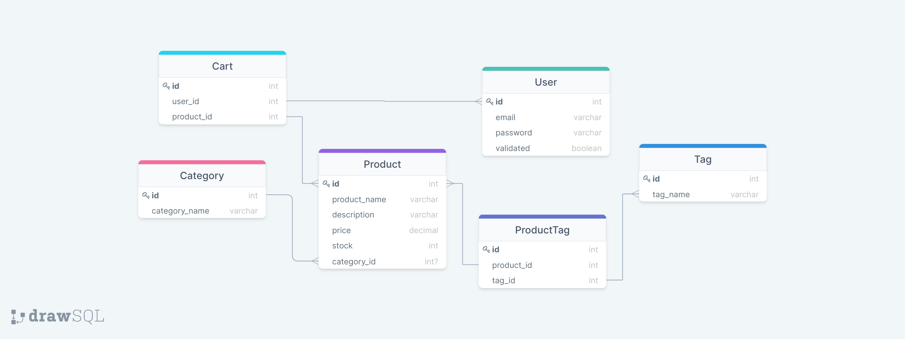
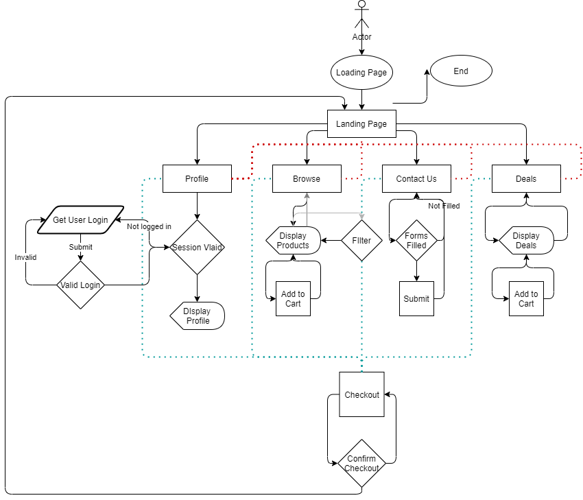

# Music Market <!-- omit in toc -->
- [Description](#description)
  - [User Story](#user-story)
- [Technologies Used](#technologies-used)
  - [Languages](#languages)
  - [Dependencies](#dependencies)
- [Demo](#demo)
- [Directions for Future Development](#directions-for-future-development)
## Description
The pandemic was, and still is, a huge hit for music and local business. This hasn’t stopped the musicians and music enthusiasts from finding ways to scratch that music itch, but it has limited their options for connecting with other local musicians and crafters of music products.

Music Market is a digital marketplace that connects local vendors of artisanal music products to musicians and music enthusiasts. Vendors are able to sell their goods while still being COVID safe, while musicians will be able to get high-quality instruments at competitive prices. By being able to browse and filter to their liking, musicians will have no problem finding the supplies they need to hit the ground running as venues start to open back up. 

### User Story
```
AS A music vendor 
I WANT a website to sell my wares to local musicians and music enthusiasts 
SO THAT I can reach a wider audience of patrons.
```

## Technologies Used
### Languages
 - HTML/CSS
 - JavaScript

### Dependencies
 - **Axios** - front-end queries to make requests syntactically easier
 - Bcrypt - hashing passwords for security
 - Connect-session-sequelize - session management
 - Dotenv - store environment variables
 - Express - JavaScript server creation
 - Express-handlebars - easy html templating
 - Express-session - session management
 - MySql2 - database connection management
 - Nodemailer - server-side emailing
 - Sequelize - orbject relation mapping

## Demo
Our application is currently deployed using heroku and can be found [here](https://stark-citadel-98109.herokuapp.com/).

A demo video of our deployed application can be found [here](https://www.youtube.com/watch?v=0_nQaP8IQkk).

Although there have been minor changes, the diagrams below show our database structure and user map of our website.



## Directions for Future Development
- complete cart and transaction functionality
- complete browsing items by tags
- complete contact form functionality to send email to admin and confirmation email to user
- add email functionality to user when they complete a purchase
- add a content management system for vendors to see their products
- expand search parameters to include location and vendor
- add email funcitonality to send registered users promotions on their favorite vendors and products
- expand payment and login options with more robust authentication